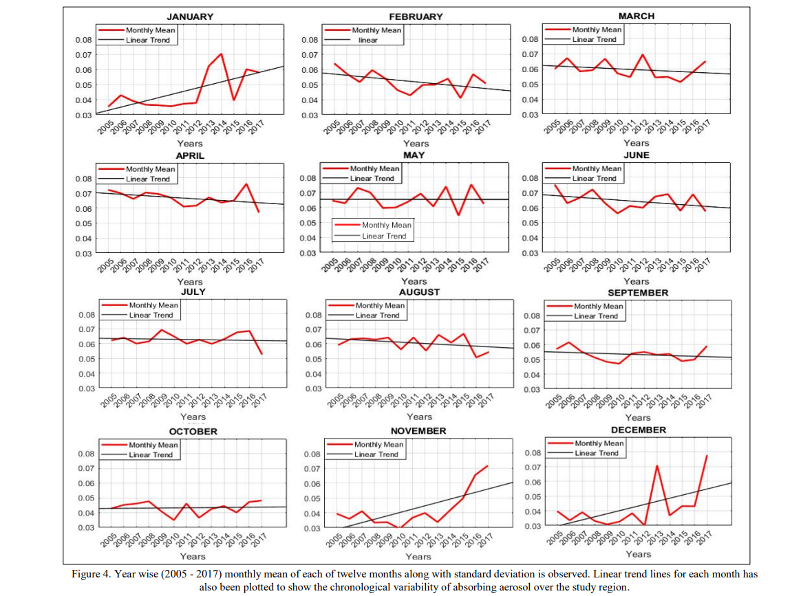
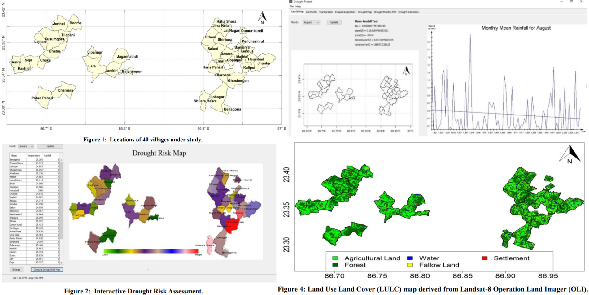

# myGIS

Contains my contributions on the projects in Geospatial field.

## 1. Master's Thesis

### 1.1. Aim

- Smoke and Dust Particle Detection due to Forest Fire over a selected **area of interest** using satellite remote sensing images from NASA, ISRO.

### 1.2. Data

- CALIPSO
- MODIS
- OMI
- NOAA
- MISR

### 1.3. Course of Action

- Proof of forest fire

- Land Surface Temperature (LST) of the area of interest

- AOD

= Vertical Profiling

### 1.4. Visualization

### 1.5 Publication:

> Ghosh, Arka, Manu Mehta, and Soubhik Biswas. "[Study of Aerosol Distribution over the Potential Sink Region During Central Portugal Forest Fire Event](https://doi.org/10.1109/icccnt.2018.8493968)." _In the 9th International Conference on Computing, Communication and Networking Technologies (ICCCNT), IEEE_ 2018.

> Ghosh, Arka, Manu Mehta, and Soubhik Biswas. "[Study of Vertical Distribution of Aerosols During Central Portugal Forest Fire Event Using Remote Sensing Data](https://www.krishisanskriti.org/vol_image/28Oct201807104701%20%20%20%20%20%20Arka%20Ghosh%20%20%20%20%20%20%20%20%20%20263-267.pdf)." _Krishi Sanskriti Publication Journal of Basic and Applied Engineering Research p-ISSN: 2350-0077; e-ISSN: 2350-0255; Volume 5, Issue 4_ 2018.

> Biswas, Soubhik, Manu Mehta, and Arka Ghosh. "[Study of Aerosol Distribution in the Vertical Air Column of Atmosphere during Uttarakhand Forest Fires 2016](https://doi.org/10.1109/rteict42901.2018.9012355)." _In the 3rd International Conference on Recent Trendsin Electronics, Information and Communication Technology (RTEICT). IEEE_ 2018.

## 2. Impact of Atmospheric Parameters over Snow Cover Meting of Himalayan Region

### 2.1. Aim

### 2.2. Data

**Vector Data** : [Hindu Kush Himalayan (HKH) Region](https://rds.icimod.org/home/datadetail?metadataid=3924)

**Raster Data** :

### 2.3. Course of Action

### 2.4. Visualization

### 2.5. Publication

> Ghosh, Arka, Manu Mehta, Soubhik Biswas, Mahak Gumber, and Meghna Mittal. "[Absorbing Aerosol Levels Across The Central And Western Himalayan Region–A Remote Sensing Approach](https://doi.org/10.5194/isprs-archives-XLII-5-519-2018)." _The International Archives of the Photogrammetry, Remote Sensing and Spatial Information Sciences pp-519-522 (v42)_ 2018.

> Biswas, Soubhik, Manu Mehta, and Arka Ghosh. "[On the trends in snow cover during the winter season over the north – eastern himalayas (2000 – 2018)](https://drive.google.com/file/d/1R6bqxwA7jmEWZEkM2r9wDMBEnT-jlrci/view)." _Journal of Remote Sensing \& GIS, 10(1), pp.1-8. ISSN: 2230-7990 (Online), ISSN: 2321-421X (Print) Volume 10, Issue 1_ 2019.

## 3. Estimation of Ground Water Storage (GWS) Over India's Major River Basins using Gravitational Anomaly Data

### 3.1. Aim

- Gravitational Anomaly (GA) Trend analysis and observation over India and it's 14 river basins for the timeframe of 2002 to 2017 (16 Years).

- Qualitative analysis of TWS, CWS, SMSC, Rainfall of 14 major river basins of India using gravitational anomaly data.

- Finally Ground water storage (GWS) estimation over 14 major river basins using TWS, CWS, SMSC and Rainfall.

### 3.2. Data

**Vector Data** : 14 major river basins

**Raster Data** : [GRACE Global Surface Mass Anomalies Data](https://grace.jpl.nasa.gov/)

### 3.3. Course of Action

- Gravitational Anomaly (GA) Trend analysis and observation over India and it's 14 river basins for the timeframe of 2002 to 2017 (16 Years).

- Qualitative analysis of TWS, CWS, SMSC, Rainfall of 14 major river basins of India using gravitational anomaly data.

- Finally Ground water storage (GWS) estimation over 14 major river basins using TWS, CWS, SMSC and Rainfall.

### 3.4. Visualization

Following figure depicts the different regions of India along with a graph showing Annual Mean of Gravitational Anomaly of Northern, Eastern, North-East region, Southern, Western and central region over the time period of 2002 -2017.

Following figure depicts all 14 major river basins of India as areas of interest. It also displays different water storage distribution over **Ganga_basin** as an example. Similar analysis have been carried out for rest of the river basins over the time period of 2002 -2017.

<!-- ### 3.5. Publication -->

<!-- > Ghosh, Arka, Manu Mehta, Soubhik Biswas, Mahak Gumber, and Meghna Mittal. "[Absorbing Aerosol Levels Across The Central And Western Himalayan Region–A Remote Sensing Approach](https://doi.org/10.5194/isprs-archives-XLII-5-519-2018)." _The International Archives of the Photogrammetry, Remote Sensing and Spatial Information Sciences pp-519-522 (v42)_ 2018. -->

## 4. Change in Sea Surface Temperature (SST) Distribution

### 4.1. Aim

### 4.2. Data

- **Permanent Service for Mean Sea Level** ([PSMSL](https://psmsl.org/)) is the global data bank for long term sea level change information from tide gauges and bottom pressure recorders.

- AVISO Mean Sea Level Data ([MSL](https://www.aviso.altimetry.fr/en/data/products/ocean-indicators-products/mean-sea-level.html))

### 4.3. Course of Action

### 4.4. Visualization

Global mean sea level rise is caused primarily by two factors related to global warming: the added water from melting land-based ice sheets and glaciers and the expansion of seawater as it warms. Following shows the MSL of Bay of Bengal measured from four control points over past 100 years (approx).

Slope of SST changes over Bay of Bengal and Mediterranean Sea.

### 4.5. Publication

> Ghosh, Arka, Anirban Mukhopadhyay, Niloy Pramanick, Soubhik Biswas, Debashis Mitra, and Tuhin Ghosh. "[Interannual and intraannual comparative study of sea surface temperature distribution over the Bay of Bengal, the Arabian Sea, and the Mediterranean Sea within the time frame of 2003–18](https://doi.org/10.1016/B978-0-323-85195-4.00023-8)." _In Disaster Resilience and Sustainability, Elsevier_, 2021.

## 5. Drought Risk Assessment Impacted by Climate Change

### 5.1. Aim

- Build a Spatial Decision Support System (SDSS) to
  provide a real-time dynamic computation of relative
  drought vulnerability index (RDVI) for selected areas of interest in India.

### 5.2. Data

### 5.3. Course of Action

### 5.4. Visualization

<!-- 

 -->

### 5.5. Publication

> Soubhik Biswas, Ghosh, Arka, Niloy Pramanick, Anirban Mukhopadhyay and Sugata Hazra.. "[Spatial Decision Support System for Climate Change Impact Assessment in> Selected Blocks of Purulia and Bankura](https://imetsociety.org/wp-content/pdf/vayumandal/2020462/2020462_9.pdf)." _VayuMandal Publication, Vol 46, Issue 2, Indian Meteorological Society (IMS)_, 2020.

## 6. Sea Ice Concentration over Hudson Bay, Canada

### 5.1. Aim

### 5.2. Data

- [Jason 1](https://www.aviso.altimetry.fr/en/missions/past-missions/jason-1.html)
- [Jason 2](https://www.aviso.altimetry.fr/en/missions/past-missions/jason-2.html)
- [Jason 3](https://www.aviso.altimetry.fr/en/missions/current-missions/jason-3/objectives.html)

### 5.3. Course of Action

### 5.4. Visualization

<!-- 

 -->

## Off to PhD in Europe 🌍 ✈
