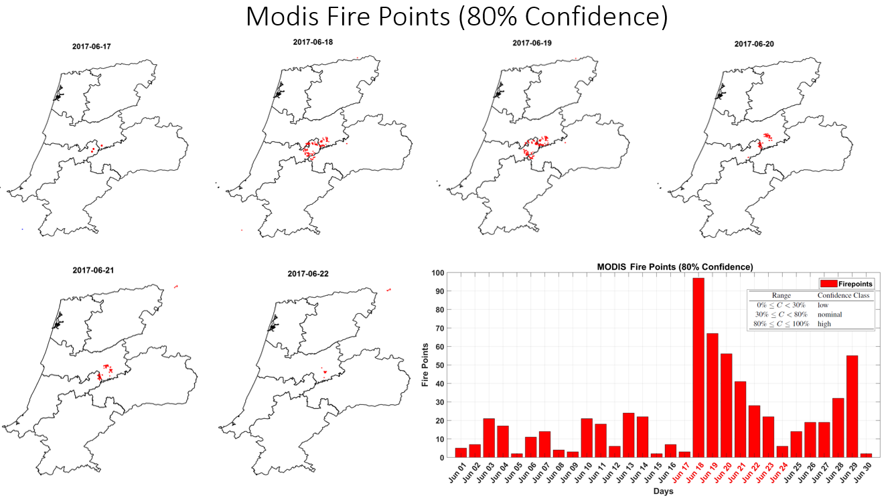
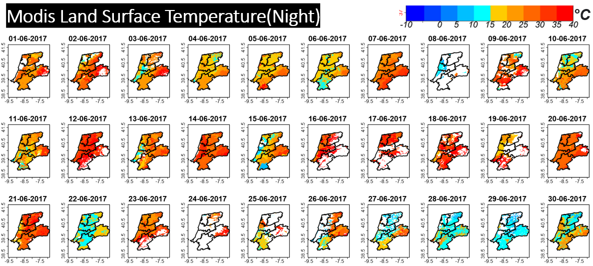
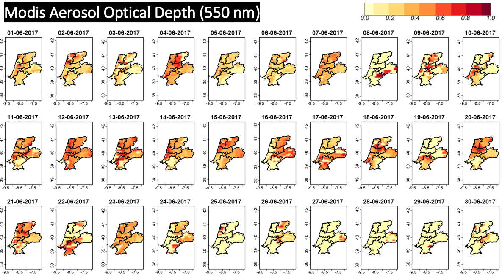
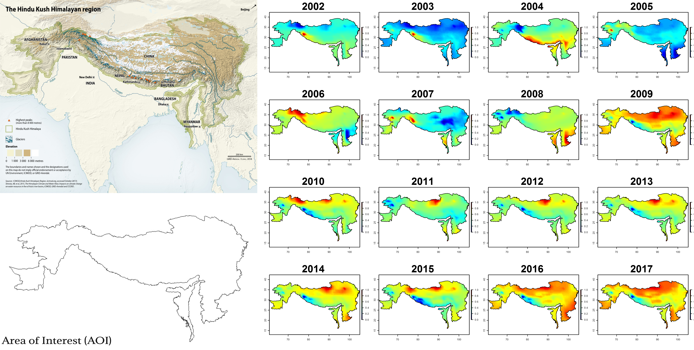
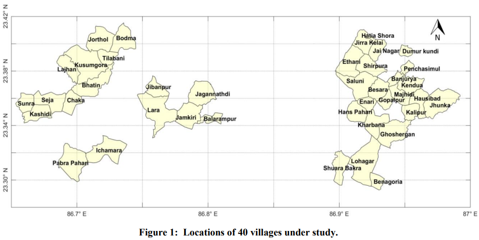
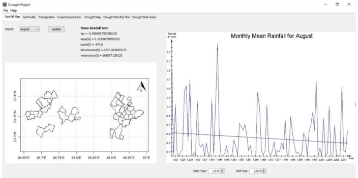
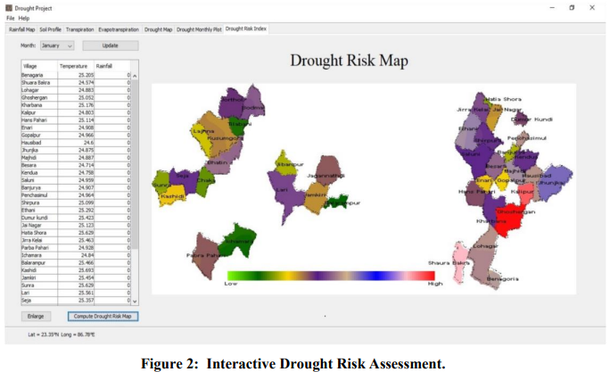
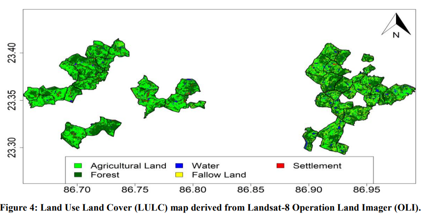

# myGIS

Contains my contributions on the projects in Geospatial field.

## 1. Master's Thesis

### 1.1. Aim

- Smoke and Dust Particle Detection due to Forest Fire over a selected **area of interest** using satellite remote sensing images from NASA, ISRO.

### 1.2. Data

### 1.3. Course of Action

- Proof of forest fire

- Land Surface Temperature (LST) of the area of interest

- AOD

### 1.4. Visualization

### 1.5 Publication:

> Ghosh, Arka, Manu Mehta, Soubhik Biswas, Mahak Gumber, and Meghna Mittal. "[Absorbing Aerosol Levels Across The Central And Western Himalayan Region–A Remote Sensing Approach](https://doi.org/10.5194/isprs-archives-XLII-5-519-2018)." _The International Archives of the Photogrammetry, Remote Sensing and Spatial Information Sciences pp-519-522 (v42)_ 2018.

> Ghosh, Arka, Manu Mehta, Soubhik Biswas, Mahak Gumber, and Meghna Mittal. "[Absorbing Aerosol Levels Across The Central And Western Himalayan Region–A Remote Sensing Approach](https://doi.org/10.5194/isprs-archives-XLII-5-519-2018)." _The International Archives of the Photogrammetry, Remote Sensing and Spatial Information Sciences pp-519-522 (v42)_ 2018.

> Ghosh, Arka, Manu Mehta, Soubhik Biswas, Mahak Gumber, and Meghna Mittal. "[Absorbing Aerosol Levels Across The Central And Western Himalayan Region–A Remote Sensing Approach](https://doi.org/10.5194/isprs-archives-XLII-5-519-2018)." _The International Archives of the Photogrammetry, Remote Sensing and Spatial Information Sciences pp-519-522 (v42)_ 2018.

## 2. Himalayan Region

### 2.1. Aim

### 2.2. Data

**Vector Data** : [Hindu Kush Himalayan (HKH) Region](https://rds.icimod.org/home/datadetail?metadataid=3924)

**Raster Data** :

### 2.3. Course of Action

### 2.4. Visualization

### 2.5. Publication

> Ghosh, Arka, Manu Mehta, Soubhik Biswas, Mahak Gumber, and Meghna Mittal. "[Absorbing Aerosol Levels Across The Central And Western Himalayan Region–A Remote Sensing Approach](https://doi.org/10.5194/isprs-archives-XLII-5-519-2018)." _The International Archives of the Photogrammetry, Remote Sensing and Spatial Information Sciences pp-519-522 (v42)_ 2018.

## 3. Estimation of Ground Water Storage (GWS) Over India's Major River Basins using Gravitational Anomaly Data

### 3.1. Aim

- Gravitational Anomaly (GA) Trend analysis and observation over India and it's 14 river basins for the timeframe of 2002 to 2017 (16 Years).

- Qualitative analysis of TWS, CWS, SMSC, Rainfall of 14 major river basins of India using gravitational anomaly data.

- Finally Ground water storage (GWS) estimation over 14 major river basins using TWS, CWS, SMSC and Rainfall.

### 3.2. Data

**Vector Data** : 14 major river basins

**Raster Data** : [GRACE Global Surface Mass Anomalies Data](https://grace.jpl.nasa.gov/)

### 3.3. Course of Action

- Gravitational Anomaly (GA) Trend analysis and observation over India and it's 14 river basins for the timeframe of 2002 to 2017 (16 Years).

- Qualitative analysis of TWS, CWS, SMSC, Rainfall of 14 major river basins of India using gravitational anomaly data.

- Finally Ground water storage (GWS) estimation over 14 major river basins using TWS, CWS, SMSC and Rainfall.

### 3.4. Visualization

### 3.5. Publication

<!-- > Ghosh, Arka, Manu Mehta, Soubhik Biswas, Mahak Gumber, and Meghna Mittal. "[Absorbing Aerosol Levels Across The Central And Western Himalayan Region–A Remote Sensing Approach](https://doi.org/10.5194/isprs-archives-XLII-5-519-2018)." _The International Archives of the Photogrammetry, Remote Sensing and Spatial Information Sciences pp-519-522 (v42)_ 2018. -->

## 4. Sea Surface Temperature (SST)

### 4.1. Aim

### 4.2. Data

### 4.3. Course of Action

### 4.4. Visualization

### 4.5. Publication

> Ghosh, Arka, Manu Mehta, Soubhik Biswas, Mahak Gumber, and Meghna Mittal. "[Absorbing Aerosol Levels Across The Central And Western Himalayan Region–A Remote Sensing Approach](https://doi.org/10.5194/isprs-archives-XLII-5-519-2018)." _The International Archives of the Photogrammetry, Remote Sensing and Spatial Information Sciences pp-519-522 (v42)_ 2018.

## 5. Drought Risk Assessment Impacted by Climate Change

### 5.1. Aim

- Build a Spatial Decision Support System (SDSS) to
  provide a real-time dynamic computation of relative
  drought vulnerability index (RDVI) for selected areas of interest in India.

### 5.2. Data

### 5.3. Course of Action

### 5.4. Visualization

### 5.5. Publication

> Soubhik Biswas, Ghosh, Arka, Niloy Pramanick, Anirban Mukhopadhyay and Sugata Hazra.. "[Spatial Decision Support System for Climate Change Impact Assessment in> Selected Blocks of Purulia and Bankura](https://imetsociety.org/wp-content/pdf/vayumandal/2020462/2020462_9.pdf)." _VayuMandal Publication, Vol 46, Issue 2, Indian Meteorological Society (IMS)_, 2020.

## 6. Sea Ice Concentration over Hudson River, Canada

## Off to PhD in Europe 🌍 ✈
