# Geographic Information System (GIS) Projects

Contains my contributions on the several projects in **GeoInformatics** field powered by my theoritical knowledge and working proficiency in computer science (CS) and GIS.

## Table of Contents

1. [Master's Thesis](#1-masters-thesis-2018)
2. [Impact of Atmospheric Parameters over Snow Cover of Himalayan Region](#2-impact-of-atmospheric-parameters-over-snow-cover-of-himalayan-region-2018)
3. [Estimation of Ground Water Storage (GWS) Over India's Major River Basins using Gravitational Anomaly Data](#3-estimation-of-ground-water-storage-gws-over-indias-14-major-river-basins-using-gravitational-anomaly-data-2019)
4. [Seasonal Change in Sea Surface Temperature (SST) Distribution](#4-seasonal-change-in-sea-surface-temperature-sst-distribution-2019)
5. [Drought Risk Assessment due to impacts of Climate Change](#5-drought-risk-assessment-due-to-impacts-of-climate-change-2019)
6. [Landfast Sea Ice Concentration over Hudson Bay Canada](#6-landfast-sea-ice-concentration-over-hudson-bay-canada-2020)
7. [GeoVisual Analytics](#7-geovisual-analytics-2020)
8. [NVIDIA Disaster Risk Monitoring Using Satellite Imagery](#8-nvidia-disaster-risk-monitoring-using-satellite-imagery-2024)
9. [Processing and Querying Multidimentional Raster Data by using Knowledge Graph (KG)](#9-processing-and-querying-multidimentional-raster-data-by-using-knowledge-graph-2022-ongoing)

## 1. Master's Thesis (2018)

### 1.1. Aim

- Detection and Classification of Aerosol Distributuon Propoerties (Smoke and Dust Particles) and Vertical Profile of the Earth's Atomoshphere during FOoest Fire Event over a chosen **Areas of Interest (AOI)** using satellite imageries from remote sensors of NASA, ESA, ISRO.


### 1.2. Data

Retrieved disparate datasources including raster array, geomtrical data, tabular data from the following remote sensors

- Cloud-Aerosol Lidar and Infrared Pathfinder Satellite Observations ([CALIPSO](https://www-calipso.larc.nasa.gov/about/))
- Moderate resolution Imaging Spectroradiometer ([MODIS](https://modis.gsfc.nasa.gov/data/))
- Ozone Monitoring Instrument ([OMI](https://aura.gsfc.nasa.gov/omi.html))
- National Oceanic and Atmospheric Administration ([NOAA](https://gml.noaa.gov/aero/science/))
- Multiangle Imaging SpectroRadiometer ([MISR](https://misr.jpl.nasa.gov/mission/introduction/))
- Hybrid Single Particle Lagrangian Integrated Trajectory Model ([HYSPLIT](https://www.arl.noaa.gov/hysplit/))
- Global Administrative Areas ([GADM](https://gadm.org/)) - Country Boundaries (geometries)

#### 1.2.1 Formats
- NetCDF4
- HDF
- CSV
- SQL

### 1.3. Course of Action

- Choose Area of Interest (AOI)

- Check existence of forest fire over AOI

- If found then check MODIS Land Surface Temperature (LST) over AOI

- Aerosol Optical Depth (AOD) Over AOI - Process raster array data from MODIS, MISR, OMI to visualize over map.

- Vertical Feature Profiling of Atmosphere

- **For more detals check the Thesis** ([.pdf](https://drive.google.com/file/d/1fT4-MToWqFJexTumgkoG0wUbIhCh9FhH/view))

### 1.4. Visualization (selected)

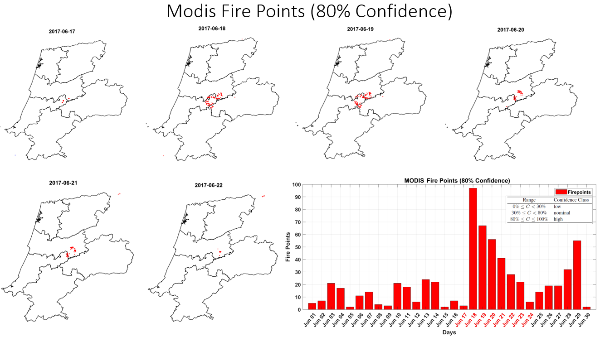

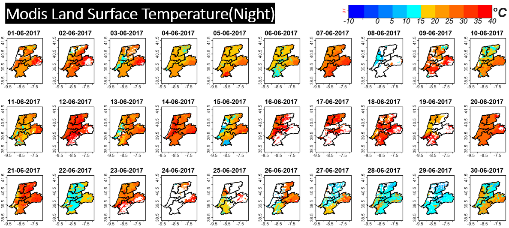

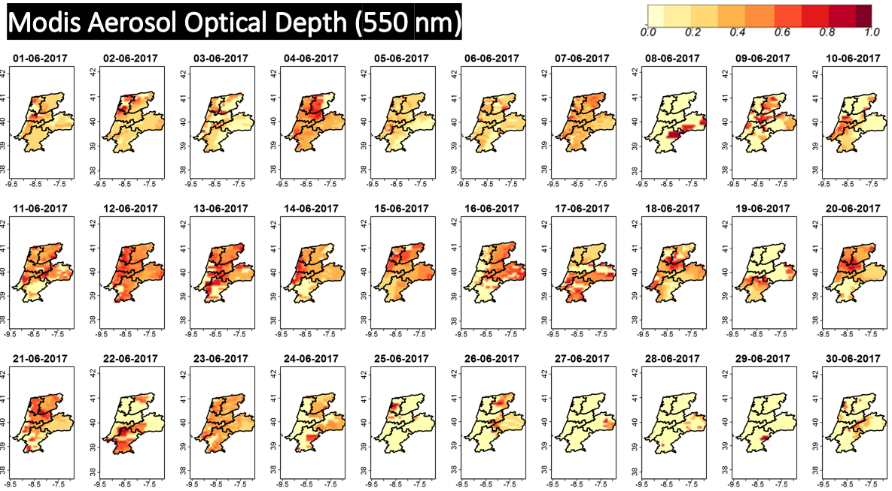

### 1.5 Publication:

> Ghosh, Arka, Manu Mehta, and Soubhik Biswas. "[Study of Aerosol Distribution over the Potential Sink Region During Central Portugal Forest Fire Event](https://doi.org/10.1109/icccnt.2018.8493968)." _In the 9th International Conference on Computing, Communication and Networking Technologies (ICCCNT), IEEE_ 2018.

> Ghosh, Arka, Manu Mehta, and Soubhik Biswas. "[Study of Vertical Distribution of Aerosols During Central Portugal Forest Fire Event Using Remote Sensing Data](https://www.krishisanskriti.org/vol_image/28Oct201807104701%20%20%20%20%20%20Arka%20Ghosh%20%20%20%20%20%20%20%20%20%20263-267.pdf)." _Krishi Sanskriti Publication Journal of Basic and Applied Engineering Research p-ISSN: 2350-0077; e-ISSN: 2350-0255; Volume 5, Issue 4_ 2018.

> Biswas, Soubhik, Manu Mehta, and Arka Ghosh. "[Study of Aerosol Distribution in the Vertical Air Column of Atmosphere during Uttarakhand Forest Fires 2016](https://doi.org/10.1109/rteict42901.2018.9012355)." _In the 3rd International Conference on Recent Trendsin Electronics, Information and Communication Technology (RTEICT). IEEE_ 2018.

## 2. Impact of Atmospheric Parameters over Snow Cover of Himalayan Region (2018)

### 2.1. Aim

- How snow cover is changing (melting) with different atmospheric parameters e.g. aerosols at different altitude levels of our **area of interest - Hindu Kush Himalayan (HKH) Region**

- Detection of dust and smoke aerosol presence at different altitude levels.

- How much snow cover has been reduced or melted over past 10 years (2006-2017) and if there any relation due to presence of aerosols (if any).

### 2.2. Data

**Vector Data** : [Hindu Kush Himalayan (HKH) Region](https://rds.icimod.org/home/datadetail?metadataid=3924)

**Raster Data** :

### 2.3. Course of Action

- Compute and visualize snow cover distribution over Hindu Kush Himalayan (HKH) Region at differen t altitude levels. (1000-8000 meters)

- Visualize aerosol distribution over the same region.

- Compare distribution snow cover at different altitude levels with the aerosol present in the atmosphere and how they are changing.

### 2.4. Visualization

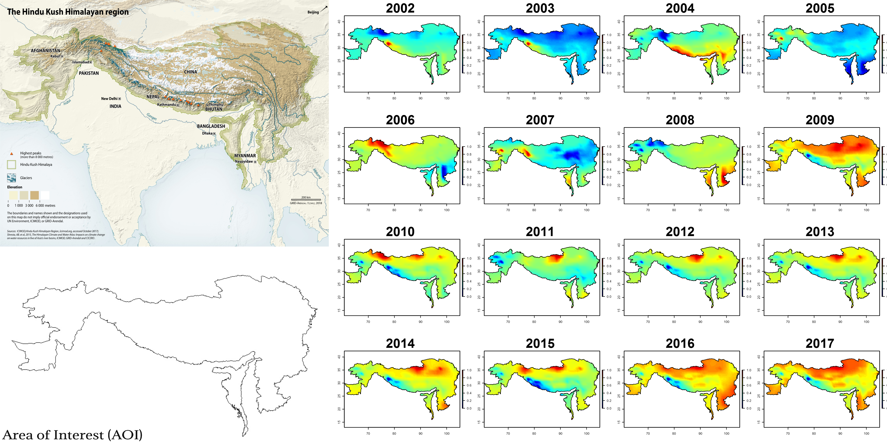

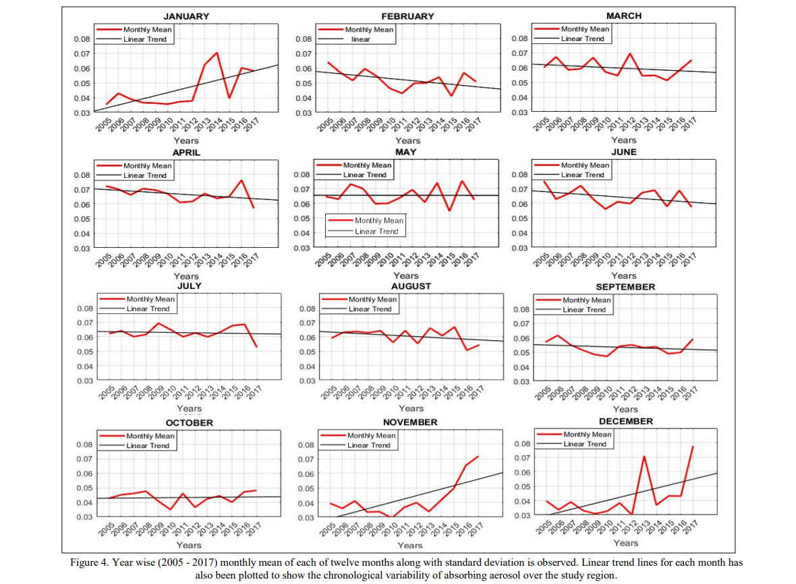

### 2.5. Publication

> Ghosh, Arka, Manu Mehta, Soubhik Biswas, Mahak Gumber, and Meghna Mittal. "[Absorbing Aerosol Levels Across The Central And Western Himalayan Region–A Remote Sensing Approach](https://doi.org/10.5194/isprs-archives-XLII-5-519-2018)." _The International Archives of the Photogrammetry, Remote Sensing and Spatial Information Sciences pp-519-522 (v42)_ 2018.

> Biswas, Soubhik, Manu Mehta, and Arka Ghosh. "[On the trends in snow cover during the winter season over the north – eastern himalayas (2000 – 2018)](https://drive.google.com/file/d/1R6bqxwA7jmEWZEkM2r9wDMBEnT-jlrci/view)." _Journal of Remote Sensing \& GIS, 10(1), pp.1-8. ISSN: 2230-7990 (Online), ISSN: 2321-421X (Print) Volume 10, Issue 1_ 2019.

## 3. Estimation of Ground Water Storage (GWS) Over India's 14 Major River Basins using Gravitational Anomaly Data (2019)

### 3.1. Aim

- Gravitational Anomaly (GA) Trend analysis and observation over India and it's 14 river basins for the timeframe of 2002 to 2017 (16 Years).

- Qualitative analysis of TWS, CWS, SMSC, Rainfall of 14 major river basins of India using gravitational anomaly data.

- Finally Ground water storage (GWS) estimation over 14 major river basins using TWS, CWS, SMSC and Rainfall.

### 3.2. Data

**Vector Data** : 14 major river basins

**Raster Data** : [GRACE Global Surface Mass Anomalies Data](https://grace.jpl.nasa.gov/)

### 3.3. Course of Action

- Gravitational Anomaly (GA) Trend analysis and observation over India and it's 14 river basins for the timeframe of 2002 to 2017 (16 Years).

- Qualitative analysis of TWS, CWS, SMSC, Rainfall of 14 major river basins of India using gravitational anomaly data.

- Finally Ground water storage (GWS) estimation over 14 major river basins using TWS, CWS, SMSC and Rainfall.

### 3.4. Visualization

Following figure depicts the different regions of India along with a graph showing Annual Mean of Gravitational Anomaly of Northern, Eastern, North-East region, Southern, Western and central region over the time period of 2002 -2017.


Following figure depicts all 14 major river basins of India as areas of interest. It also displays different water storage distribution over **Ganga_basin** as an example. Similar analysis have been carried out for rest of the river basins over the time period of 2002 -2017.


<!-- ### 3.5. Publication -->

<!-- > Ghosh, Arka, Manu Mehta, Soubhik Biswas, Mahak Gumber, and Meghna Mittal. "[Absorbing Aerosol Levels Across The Central And Western Himalayan Region–A Remote Sensing Approach](https://doi.org/10.5194/isprs-archives-XLII-5-519-2018)." _The International Archives of the Photogrammetry, Remote Sensing and Spatial Information Sciences pp-519-522 (v42)_ 2018. -->

## 4. Seasonal Change in Sea Surface Temperature (SST) Distribution (2019)

### 4.1. Aim

### 4.2. Data

- **Permanent Service for Mean Sea Level** ([PSMSL](https://psmsl.org/)) is the global data bank for long term sea level change information from tide gauges and bottom pressure recorders.

- AVISO Mean Sea Level Data ([MSL](https://www.aviso.altimetry.fr/en/data/products/ocean-indicators-products/mean-sea-level.html))

### 4.3. Course of Action

### 4.4. Visualization

Global mean sea level rise is caused primarily by two factors related to global warming: the added water from melting land-based ice sheets and glaciers and the expansion of seawater as it warms. Following shows the MSL of Bay of Bengal measured from four control points over past 100 years (approx).


Slope of SST changes over Bay of Bengal and Mediterranean Sea.


### 4.5. Publication

> Ghosh, Arka, Anirban Mukhopadhyay, Niloy Pramanick, Soubhik Biswas, Debashis Mitra, and Tuhin Ghosh. "[Interannual and intraannual comparative study of sea surface temperature distribution over the Bay of Bengal, the Arabian Sea, and the Mediterranean Sea within the time frame of 2003–18](https://doi.org/10.1016/B978-0-323-85195-4.00023-8)." _In Disaster Resilience and Sustainability, Elsevier_, 2021.

## 5. Drought Risk Assessment due to impacts of Climate Change (2019)

### 5.1. Aim

- Built a Spatial Decision Support System (SDSS) to
  provide a real-time dynamic computation of relative
  drought vulnerability index (RDVI) for selected areas of interest in India affected by by Climate Change.

### 5.2. Data

### 5.3. Course of Action

- Drought analysis is to be carried out with drought indices like the

  - Standardized Precipitation Index (<b>SPI</b>)
  - Temperature Condition Index (<b>TCI</b>)
  - Vegetation Condition Index (<b>VCI</b>)

- <b>Mann-Kendall Test</b>
  and <b> Sen Slope Estimator</b> was used for in-depth analysis of daily rainfall data
  over <b>115 years (1901-2015)</b>.

### 5.4. Visualization

Screenshots of Spatial Decision Support System (SDSS)
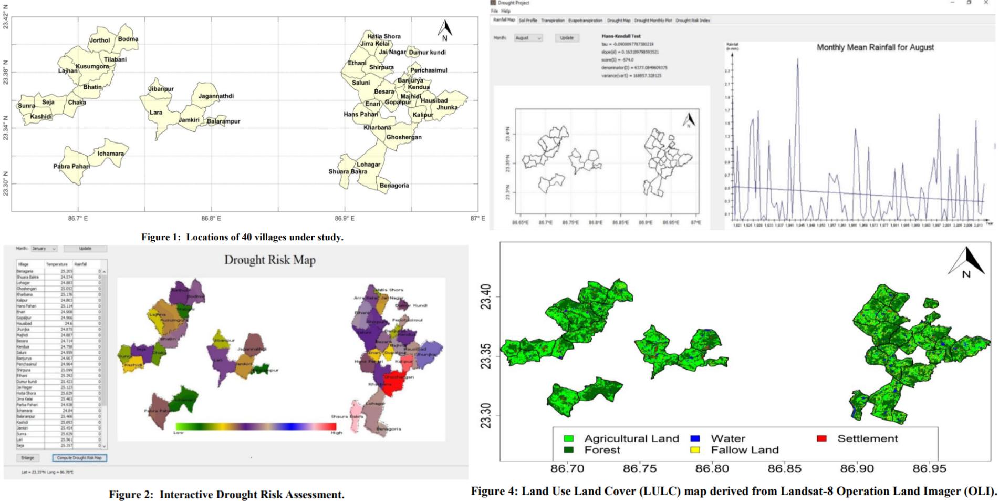

<!-- 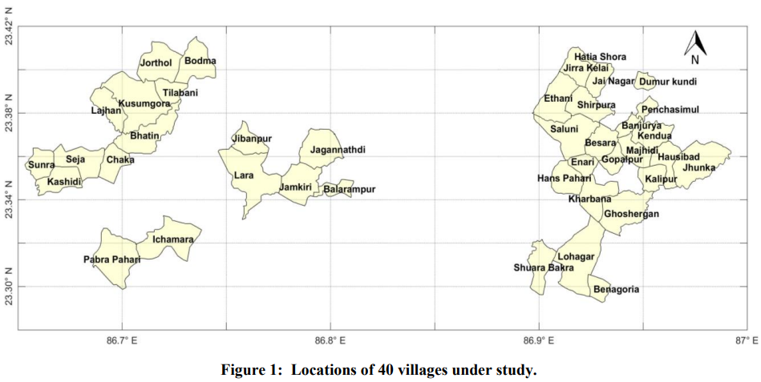
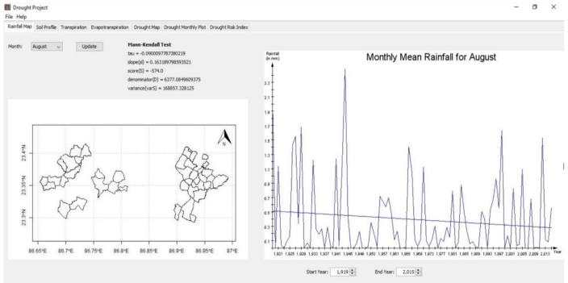
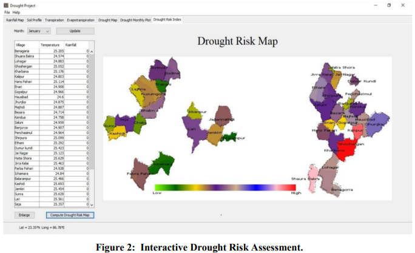
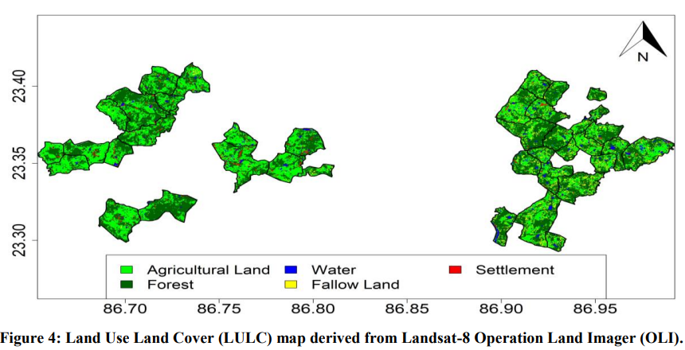 -->

### 5.5. Publication

> Soubhik Biswas, Ghosh, Arka, Niloy Pramanick, Anirban Mukhopadhyay and Sugata Hazra.. "[Spatial Decision Support System for Climate Change Impact Assessment in> Selected Blocks of Purulia and Bankura](https://imetsociety.org/wp-content/pdf/vayumandal/2020462/2020462_9.pdf)." _VayuMandal Publication, Vol 46, Issue 2, Indian Meteorological Society (IMS)_, 2020.

## 6. Landfast Sea Ice Concentration over Hudson Bay Canada (2020)

### 6.1. Aim

- Comparative analysis of Canadian Ice Service ice charts to characterize the temporal and spatial variability of landfast sea ice (or fast ice) surrounding Hudson Bay from 2000 to 2019.

### 6.2. Data

- [Jason 1](https://www.aviso.altimetry.fr/en/missions/past-missions/jason-1.html)
- [Jason 2](https://www.aviso.altimetry.fr/en/missions/past-missions/jason-2.html)
- [Jason 3](https://www.aviso.altimetry.fr/en/missions/current-missions/jason-3/objectives.html)

### 6.3. Course of Action

### 6.4. Visualization (QGIS)


<!-- 


 -->

## 7. GeoVisual Analytics (2020)

### 7.1. Aim

- Accessing geospatial raster data i.e., `precipitation` represented in`netcdf` and `geotiff` format through `xarray` to analysis them and plot stunning visalisation using matplotlib and seaborn to potray the knowledge behind those satellite raster images.

- I extracted daily data, find monthly totals, find spatial average of precipitation in a given domain, plot the results, and save the outputs as netcdf files

### 7.2. Data

- Gridded precipitation data (from CPC)
- CPC Unified Gauge-Based Analysis of Daily Precipitation ([link](https://psl.noaa.gov/data/gridded/data.unified.daily.conus.html))

### 7.3. Course of Action

#### Set Up Local Environment

- Create a virtual environment myvenv and activate it:

```sh
python -m venv myvenv
```
```
.\myvenv\Scripts\activate    # On Windows

# ---------------------- OR ---------------------- #

source myvenv/bin/activate  # On Linux or Mac
```
#### Install dependencies:

```sh
pip install -r requirements.txt
```
#### 🧪 Experiment with code if you want

```sh
jupyter notebook
```


### 7.4. Visualization

- Check out the jupyter [notebook](https://github.com/aghoshpro/myGIS/blob/main/Project%207%20-%20GeoVisualAnalytics%20(GeoVA)/Geospatial%20Data%20Analytics.ipynb)

# Off to PhD in Europe 🌍 ✈

## 8. NVIDIA Disaster Risk Monitoring Using Satellite Imagery (2024)

This is an [NVIDIA course](https://learn.nvidia.com/courses/course-detail?course_id=course-v1:DLI+S-ES-01+V1) where I learn to build and deploy a deep learning model to automate the detection of flood events using satellite imagery. This workflow can be applied to lower the cost, improve the efficiency, and significantly enhance the effectiveness of various natural disaster management use cases.
### 8.1. Aim

- Implement a machine learning workflow for disaster management solutions
- Use hardware accelerated tools to process large satellite imagery data
- Apply transfer-learning to cost-efficiently build deep learning segmentation models
- Deploy deep learning models for near real-time analysis
- Utilize deep learning-based model inference to detect and respond to flood event

### 8.2. Data

- [Sentinel-1 SAR](https://github.com/cloudtostreet/Sen1Floods11) -  available from [ESA](https://www.esa.int/) via the [Copernicus Open Access Hub](https://scihub.copernicus.eu/). Also, available via NASA's [EARTHDATASEARCH](https://search.earthdata.nasa.gov/) or [Vertex](https://search.asf.alaska.edu/#/), Alaska Satellite Facility's data portal. 

<!-- - They are organized as tiles, which is the process of subdividing geographic data into pre-defined roughly-squares. Tile-based mapping efficiently renders, stores, and retrieves image data. -->

### 8.3. Course of Action

- **Tools, libraries, frameworks used**: NVIDIA DALI, NVIDIA TAO Toolkit, NVIDIA TensorRT, and NVIDIA Triton Inference Server.

- Check out the jupyter [notebook](https://github.com/aghoshpro/myGIS/blob/main/Project%208%20-%20Nvidia-Disaster-Risk-Monitoring-Using-Satellite-Imagery/01_disaster_risk_monitoring_systems_and_data_pre-processing.ipynb)

### 8.4. Visualization
  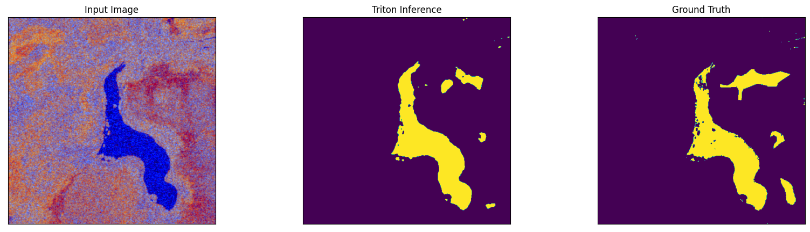

## 9. Processing and Querying Multidimentional Raster Data by using Knowledge Graph (2022-Ongoing)

### 9.1. Aim

- Researching on a knowledge graph (KG) based solution where user with minimal or no domain specific knowledge can query multidimentional raster data e.g., elevation, temperature etc. combined with tabular data, vector geometrical data including OpenStreetMap (OSM), 3DCityGML Bulding data etc.

- Considering different W3C-semantic-web standard ontologies which conceptualize the domain specific knoeldge (e.g., geospatial, robotics, medical) that frees the end user from the burdan of knowing data struture and can query the knowledge graph. 

<!-- - **NOTE** - Provided that user does not know (or minimally) any required domain knowledge reagrding the geospatial satellite data or database technology. -->

### 9.2. Data

- Vector Data (Munich's 25 distrcts and 105 sub-districts)
- OpenStreetMap Buildings Data
- 3DCityGML LOD2 Buildings Data
- 5 Types of Raster data

**Query** - List all the 30 meters tall residentials in Munich where average terrain elevation less than 550 meters and average land surface temperature is over 300K, given the following data.

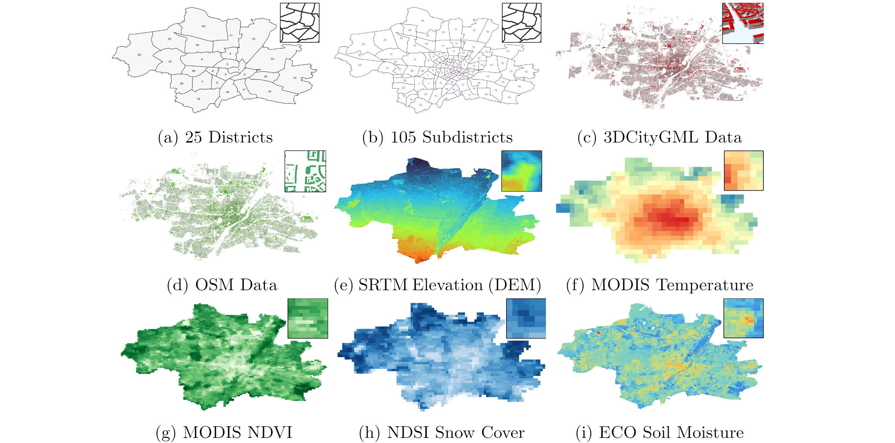

### 9.3. Course of Action

Using our developed novel _Virtual Knowledge Graph (VKG)_ framework [OntoRaster](https://github.com/aghoshpro/OntoRaster.git), we integrate and query the combined data without writing any ad-hoc script (in python or R) to access the different disparate formated geospatial data with minimal amount domain knowledge.

- OntoRaster can be applied to any arbritary geospatial data inclding the aforementioned data but limited to.

### 9.4. Visualization

Here one can see the RasSPARQL queries in action.


